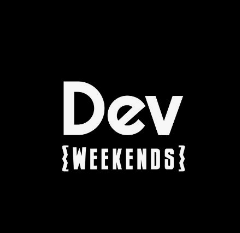
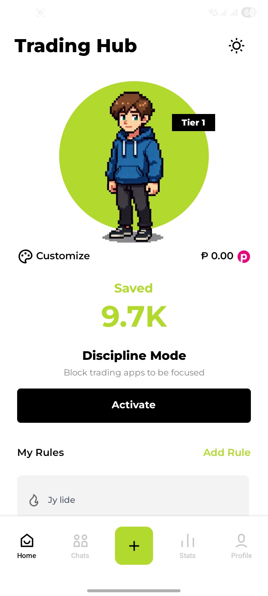
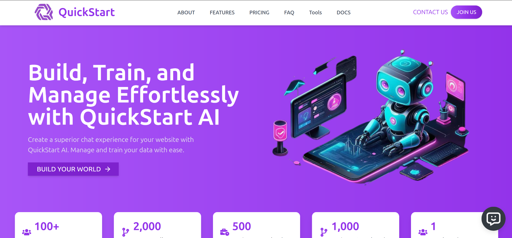

<h1 align="left">Muhammad Aqib Nawab</h1>

  <strong>Software Engineer · Full Stack · AI</strong> 
  Remote · Pakistan · 3+ years shipping production web & mobile

  I build systems that hold up under real users — ride-hailing platforms, mobile apps at <strong>10K+ downloads</strong>, franchise ops at <strong>1,500+ locations</strong>, and open source used by <strong>15M+ people</strong>. TypeScript, Node.js, NestJS, Next.js, React Native, and AI in production.

  
  
  
  

---

## Work Experience

<table>
<tr>
<td width="72" align="center" valign="top"></td>
<td valign="top">

**Software Engineer** · [RideNear](https://ridenear.com)  
`Jul 2025 — Present` · Full-Time · Remote

Multi-provider ride-hailing platform (B2B + B2C). End-to-end across frontend and backend — security, reliability, and product impact.

- RBAC with **45 permissions** across microservices (API guards + PermissionGate)
- Company tiers + feature flags for SaaS monetization and multi-tenant isolation
- Payment analytics refactor: raw SQL → Prisma ORM with complex aggregation preserved
- Real-time chat + Firebase Cloud Messaging (FCM token management, background notifications)
- CMS with rich text editor for news, careers, FAQs, legal docs — **~90% less dev time** for content updates
- MCP-connected AI agent supporting funding metrics and **2 enterprise client** onboardings

`TypeScript` `Next.js` `NestJS` `PostgreSQL` `Prisma` `Firebase` `Docker` `AWS`

</td>
</tr>

<tr><td colspan="2"> </td></tr>

<tr>
<td width="72" align="center" valign="top"></td>
<td valign="top">

**GSoC Contributor — B0Bot** · [Google Summer of Code (C2SI)](https://c2si.org/gsoc/)  
`May 2026 — Aug 2026` · Open Source · Remote

Modernizing [B0Bot](https://github.com/c2siorg/b0bot), a cybersecurity intelligence platform, from a Flask monolith to a production multi-service architecture.

- Split legacy monolith into **api-service**, **ingestion-service**, and **notification-service** (Docker Compose)
- RSS ingestion + deduplication pipeline with queue-based, idempotent job handling
- Embeddings (`all-MiniLM-L6-v2`) + **pgvector** in PostgreSQL for semantic search
- pytest coverage + notification digest safeguards (duplicate-send prevention)
- **13+ merged PRs** to [JSON-Schema (ajv)](https://github.com/ajv-validator/ajv) — async validation hooks, localized errors

`Python` `Flask` `PostgreSQL` `pgvector` `Redis` `Docker Compose` `pytest` `LangChain`

</td>
</tr>

<tr><td colspan="2"> </td></tr>

<tr>
<td width="72" align="center" valign="top"></td>
<td valign="top">

**LLM Trainer** · [Turing](https://www.turing.com/)  
`Sep 2025 — Oct 2025` · Contract · Remote

LLM evaluation pipelines — model-breaking coding problems and automated review workflows.

- Authored hard coding problems (Codeforces-style) to stress-test model reasoning
- AI-powered pre-review via GitHub Actions to reduce manual reviewer load
- Internal agents to generate and validate problems before human review

`TypeScript` `Python` `GitHub Actions` `LLM Evaluation`

</td>
</tr>

<tr><td colspan="2"> </td></tr>

<tr>
<td width="72" align="center" valign="top"></td>
<td valign="top">

**Freelance Full-Stack Engineer** · Upwork  
`Jun 2023 — Dec 2024` · Freelance · Global

**25+ end-to-end projects** for startups and brands across fintech, SaaS, e-commerce, and education.

- **[P&L App](https://pnlapp.co)** — React Native trading journal, **10K+ downloads**, **6K+ users**, Kotlin Discipline Mode, **20+ brokerages** via SnapTrade, **99.8% uptime**
- **[QuickStart AI](https://quickstartai.com/)** — no-code RAG chatbot platform, hybrid search, citation tracking · **1,500+ weekly npm downloads**
- **[R&B Tea USA](https://rbteausa.com/)** — franchise platform for **1,500+ locations**, real-time chat + onboarding
- **[Expensify](https://github.com/Expensify/App)** — critical production bug fixes on a **15M+ user** app · **$500 bounty**

`TypeScript` `Next.js` `NestJS` `React Native` `PostgreSQL` `MongoDB` `AWS` `Docker` `Kubernetes`

</td>
</tr>

<tr><td colspan="2"> </td></tr>

<tr>
<td width="72" align="center" valign="top"></td>
<td valign="top">

**Mentor** · [Dev Weekends](https://devweekends.com)  
`2024 — Present` · Volunteer · Remote

Mentoring in a **20K+** nonprofit engineering community focused on DSA and full-stack growth.

- Community sessions on DSA patterns, problem solving, and full-stack fundamentals
- **40+ fellows/year** with structured learning plans and interview prep
- Collaborating with a **50+ volunteer** team running learner-first initiatives

</td>
</tr>
</table>

---

## What I've Done

- Led **[P&L App](https://pnlapp.co)** from zero to App Store and Google Play — **10K+ downloads**, **6K+ users**, native Kotlin Discipline Mode, **20+ brokerages** via SnapTrade, **500+ daily trade syncs**
- At **RideNear**, cut B2B/B2C dashboard configuration time by **40%** with RBAC across **45 permissions**; shipped MCP-connected AI agent that supported funding and **2 enterprise clients**
- Fixed critical bugs in **Expensify** (**15M+ users**) and earned a **$500 bounty**; through **GSoC** built B0Bot's RSS ingestion + BullMQ newsletter pipeline and shipped **13+ merged PRs** to JSON-Schema
- Built **[QuickStart AI](https://www.npmjs.com/package/@quickstart-ai/chatbot)** — embeddable RAG chatbot on npm with **1,500+ weekly downloads**, hybrid BM25 + vector search, FastAPI backend handling **40+ concurrent admin sessions**
- Delivered franchise platform for **R&B Tea** (**1,500+ locations**, **100+ partnership requests**), **San Tommaso** resort booking (Guesty + Stripe, localization **doubled conversion**), and **Dental Strivers LMS** (**200+ concurrent learners**)

---

## Featured Projects

<table>
<tr>
<td width="80" align="center"></td>
<td>

**[P&L App](https://pnlapp.co)** · React Native · Node.js · Kotlin  
Neuroscience-based trading journal with AI insights, auto-journal sync across **20+ brokerages**, and Discipline Mode.  
[App Store](https://apps.apple.com/ie/app/pnl-app/id6756570340) · [Play Store](https://play.google.com/store/apps/details?id=co.pnlapp)

</td>
</tr>
<tr>
<td width="80" align="center"></td>
<td>

**[QuickStart AI](https://quickstartai.com/)** · Next.js · FastAPI · RAG  
No-code platform to create and embed AI chatbots. Hybrid search, citation tracking, **1,500+ weekly npm downloads**.  
[npm package](https://www.npmjs.com/package/@quickstart-ai/chatbot)

</td>
</tr>
</table>

<a href="https://aqibnawab.vercel.app/#projects">View all projects on portfolio →</a>

---

## Open Source

| Project | Contribution |
|---------|-------------|
| [**Expensify**](https://github.com/Expensify/App) | Critical production bug fixes on a **15M+ user** expense app · **$500 bounty** |
| [**JSON-Schema (ajv)**](https://github.com/ajv-validator/ajv) | **13+ merged PRs** — async validation hooks, localized error messages (GSoC) |
| [**B0Bot**](https://github.com/c2siorg/b0bot) | GSoC — microservices refactor, RSS ingestion pipeline, pgvector embeddings, BullMQ newsletters |

---

## Technical Writing

Articles on agents, system design, and backend engineering — full list on [aqibnawab.vercel.app/blogs](https://aqibnawab.vercel.app/blogs).

- [From Prompt Engineering to Loop Engineering](https://aqibnawab.vercel.app/blogs/prompt-to-loop-engineering) — agents, harness engineering, verification loops
- [How Twenty Queries Tables That Don't Exist in the Codebase](https://aqibnawab.vercel.app/blogs/dynamic-schema-generation-twenty) — dynamic schema generation, PostgreSQL, SaaS architecture
- [MCP vs A2A](https://aqibnawab.vercel.app/blogs/mcp-vs-a2a) — when to use each protocol for AI agent communication
- [Performance Testing Node.js Applications](https://aqibnawab.vercel.app/blogs/performance-testing) — 10K → 86K req/s with clustering and Fastify
- [WebRTC: Real-Time Communication on the Web](https://aqibnawab.vercel.app/blogs/webrtc) — signaling, STUN/TURN, P2P connections

---

## Stack

**Frontend** — React · Next.js · TypeScript · React Native · Redux · Tailwind CSS · Material UI · Zod

**Backend** — Node.js · NestJS · Express · FastAPI · GraphQL · WebSockets · REST · Redis · BullMQ · Prisma · Socket.io

**Data** — PostgreSQL · MongoDB · MySQL · Supabase · pgvector · Firebase

**AI** — LangChain · LangGraph · RAG · Pinecone · OpenAI · MCP · AI Agents

**DevOps** — Docker · Kubernetes · AWS · Azure · Terraform · GitHub Actions · Linux · Vercel

---

## Education

**Bachelor's in Information Technology** · University of Education, Township · `2022 — 2026`

**Intermediate in Computer Science** · Aspire College Chunian · `2020 — 2022`

---

  <strong>Open to full-time roles, contract work, and open-source collaborations.</strong> 
  <a href="https://aqibnawab.vercel.app">Portfolio</a> ·
  <a href="https://www.linkedin.com/in/m-aqib-nawab/">LinkedIn</a> ·
  <a href="https://github.com/AQIB-NAWAB">GitHub</a> ·
  <a href="mailto:aqibnawab1100@gmail.com">Email</a>

